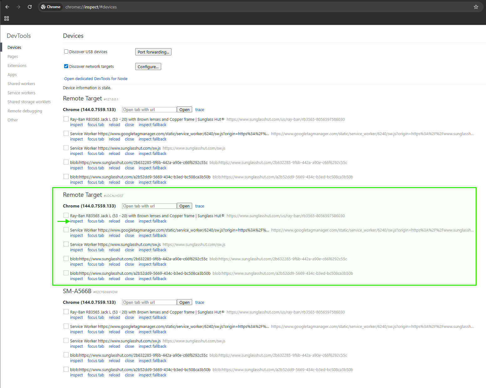
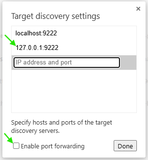

# Profiling Tool

This project provides a setup to connect Puppeteer to a Chrome instance running on an Android device, allowing for remote debugging and performance tracing.

**Puppeteer Changelog:** https://pptr.dev/CHANGELOG

## Prerequisites

Before you begin, ensure you have the following installed:

- **Node.js and npm:** [Download and install Node.js](https://nodejs.org/en/download/) (Version 18.17.0 or higher is required for Puppeteer).
- **Android Debug Bridge (ADB):** You do **not** need the full Android SDK.
  - **Download:** Get the standalone **SDK Platform-Tools** package for your OS from the [official Google developer site](https://developer.android.com/tools/releases/platform-tools).
  - **Install:** Extract the folder to a known location (e.g., `C:\platform-tools`).
  - **Configuration:** The project looks for `adb` in the following order:
    1.  **`ADB_PATH` (Recommended):** Set this environment variable to your specific executable path (e.g., `set ADB_PATH=C:\platform-tools\adb.exe`).
    2.  **System PATH:** If you added the folder to your global PATH.
    3.  **Android SDK:** Checks `ANDROID_HOME` or `ANDROID_SDK_ROOT` if a full SDK is present.
  - **PowerShell Users:** If running commands manually from the platform-tools folder, you may need to prefix them with `.\` (e.g., `.\adb devices`).
- **A physical Android device:** With **USB debugging enabled** and connected to your computer.
  - _Note:_ Ensure Chrome is installed and running on the device before starting the script.

## Setup

1.  **Install Node.js dependencies:**

    ```bash
    npm install
    ```

2.  **Connect your Android device:**

    Ensure your Android device is connected via USB and USB debugging is enabled. Verify it's recognized by ADB:

    ```bash
    adb devices
    ```

    You should see your device listed.

3.  **Forward the Chrome DevTools port (for mobile mode):**

    This command forwards the Chrome DevTools port from your Android device to your local machine (port 9222). This is only required if you intend to use the `mobile` mode.

    ```bash
    adb forward tcp:9222 localabstract:chrome_devtools_remote
    ```

    Keep this command running in a dedicated terminal or ensure it's executed before starting the `index.js` script in `mobile` mode.

## Usage

Once the setup is complete, you can use the `index.js` script to interact with Chrome on your Android device or a local desktop Chrome instance.

### 1. Start the Puppeteer connection and command server

You can start the script in either **mobile** or **desktop** mode. The command server for tracing will always run on port `8080`.

- **Mobile Mode (default):** Connects to Chrome on your Android device.

  ```bash
  npm start
  # or explicitly
  npm run start:mobile
  ```

  If no URL is provided, it will list the currently open tabs on your device.

- **Desktop Mode:** Launches a new local Chrome instance in maximized size, rendering as a full desktop view, with camera permissions automatically granted.
  ```bash
  npm run start:desktop
  ```
  If no URL is provided, it will open a blank page.

The script will keep the connection alive. To stop it, press `Ctrl+C`.

### 2. Device connection - Control Navigation - Tracing - Input - Device clean - Overrides (from a **second terminal**)

While the main script (`npm start`, `npm run start:mobile`, or `npm run start:desktop`) is running in your first terminal, you can use a second terminal to send commands to navigate to a specific URL, start and stop performance tracing, and to send input events.

> **Tip:** Refer to the `scripts` section in `package.json` for a complete list of all available manual and semi-automated commands (e.g., `npm run device:connect` `npm run input:tap-vmmv-video`, `npm run device:clean -- <url>`).

#### Override

command example: `config:overrides?target=vmp-ui-496.js&replacement=./overrides/vmp-ui-496.js`

<br/>

#### Device Close All Tabs

To close all open tabs on the Android device and open a single fresh `about:blank` page:

```bash
npm run device:close-all-tabs
```

<br/>

#### Device Clean Process

Performing this operation before each profiling iteration guarantees an accurate, non-inflated memory baseline by neutralizing the application environment without destroying the tester's personal Chrome data on the physical device.
Execution Sequence:

1. Storage cleared for origin: Obliterates persistent data (IndexedDB, Service Workers, CacheStorage) strictly for the target domain.
2. Network Cache disabled: Suspends HTTP caching to enforce a true cold-start payload fetch for the next iteration.
3. CDP Session detached from polluted tab: Drops the Chrome DevTools Protocol listener to prevent tooling-induced memory leaks.
4. Polluted execution tab destroyed: Physically closes the active tab to force the Android OS to release the associated V8 Isolate and orphaned WebAssembly memory boundaries.
5. Spawned fresh tab and navigated to about:blank: Establishes a neutral, pristine rendering frame.
6. Garbage Collection forced on fresh tab: Executes a low-level V8 memory sweep to ensure a perfect zero-state baseline before the next profiling run begins.

<br/>

#### Saving trace files

Trace files will be saved in your project directory with progressive numbering (e.g., `trace-0.json`, `trace-1.json`).

<br/>

### 3. Running Test Cases

This project includes a test runner script (`bin/profile.ts`) that allows you to execute predefined sequences of commands (test cases) from the `src/testCases.ts` file.

#### Prerequisite

The mobile device must be connected and ready as per the instructions above, with the page to be tested already open (e.g., `npm run navigate:url --  VMMV_TV20`).

#### Running a Test Case

To run a test case, use the following command:

```bash
npx ts-node bin/profile.ts <test_case_name>
```

Replace `<test_case_name>` with the name of the test case you want to run (e.g., `vmmv_tc01__tc04`).

#### Running a Test Case with a Custom Trace Name

You can also provide a custom name for the trace file by adding it as a second argument:

```bash
npx ts-node bin/profile.ts <test_case_name> <custom_trace_name>
```

For example, to run `vmmv_tc01__tc04` and save the traces as `my-custom-trace-1.json` (Puppeteer) and `my-custom-trace-1.pftrace` (Perfetto, if enabled), use:

```bash
npx ts-node bin/profile.ts vmmv_tc01__tc04 my-custom-trace
```

**Note on Trace Files:**

- **DevTools Traces:** Saved in the `devtools-output/` directory.
- **Perfetto Traces:** Saved in the `perfetto-output/` directory.

> **Tip:** Refer to the `scripts` section in `package.json` for a complete list of all available test case commands (e.g., `npm run profile:vmmv-tc01__tc04 my-custom-trace`).

## Orchestrate (Automated Multi-Run Profiling)

The Orchestrator allows you to automate a series of profiling runs across different URLs and test cases. It manages the entire lifecycle, including starting the command server, device cleaning, thermal checks, and executing predefined test cases.

### Prerequisites for Orchestration

To ensure the Orchestrator can interact with the device without interruptions:

1.  **Physical Connection:** The device must be connected via a reliable USB cable.
2.  **Stay Awake:** Ensure the screen is **unlocked** and set to "Never sleep" while charging (found in Developer Options as "Stay awake").
3.  **Chrome in Foreground:** Chrome must be the **active application** on the device's screen before starting the script.
4.  **ADB Authorized:** Ensure the "Always allow from this computer" option was selected when the USB debugging prompt appeared.
5.  **Thermal State:** While the orchestrator can wait for cooldown, starting with a cool device is recommended for the first run.

### Running the Orchestrator

To run an orchestration sequence, use:

```bash
npm run orchestrate <config_filename>
```

Replace `<config_filename>` with the name of a `.jsonc` file located in the `orchestrator-inputs/` directory (e.g., `npm run orchestrate orchestrator.jsonc`).

### Configuration (`.jsonc`)

Orchestration is configured using JSON files with comments. Key properties include:

- **`runs`**: Number of times to repeat the entire timeline.
- **`setup`**: Global settings:
  - `connect`: (boolean) Whether to automatically establish the ADB connection.
  - `checkThermal`: (boolean) Whether to wait for the device to cool down between runs.
  - `puppeteerEnv`: (string) Environment to use (corresponds to `PUPPETEER_ENV` and `.env.<env>` files).
  - `strictVersionCheck`: (boolean) If set to `true`, the tool will exit if a newer version of Puppeteer is available. This ensures protocol stability.

### Setting Strict Mode Globally

You can also enforce `strictVersionCheck` for **all commands** (including `npm start`) by setting a global environment variable.

#### Windows (PowerShell)
```powershell
$env:STRICT_VERSION_CHECK="true"
# To make it persistent for the session
```

#### Windows (Command Prompt)
```cmd
set STRICT_VERSION_CHECK=true
```

#### macOS / Linux (Bash/Zsh)
```bash
export STRICT_VERSION_CHECK=true
```

#### Using a `.env` file
Alternatively, add this line to your `.env` or `.env.<environment>` file:
```env
STRICT_VERSION_CHECK=true
```

- **`timeline`**: A list of cases to execute. Most fields support **variable references** (e.g., `urls.SPEED_TEST`, `COMMANDS.INPUT_TAP_TOP_CENTER`, `testCases.perfetto_tc04`):
  - `targetUrl`: (optional) The URL to profile (supports URL aliases defined in `src/urls.ts` or `urls.<KEY>`). If omitted, the orchestrator will perform subsequent actions on the **currently open page** without cleaning state or navigating.
  - `waitUntil`: (optional) Browser event to wait for during navigation: `load` (default), `domcontentloaded`, `networkidle0` (no more than 0 network connections for 500ms), or `networkidle2` (no more than 2 network connections for 500ms). Only applicable if `targetUrl` is provided.
  - `postNavigationDelay`: (optional) Number of milliseconds to wait after the navigation event (if any) or as a general stabilization pause before proceeding to setup commands.
  - `setupCommands`: (optional) A list of command endpoints or `COMMANDS.<KEY>` to call before starting the trace.
  - `caseName`: (optional) The name of the test case to execute (supports `testCases.<KEY>` or direct names from `src/testCases.ts`). If omitted, the orchestrator will complete the cleanup, navigation, and setup commands without recording a trace.

Example `orchestrator.jsonc`:

```jsonc
{
  "runs": 3,
  "setup": {
    "connect": true,
    "checkThermal": true,
    "puppeteerEnv": "vmcore"
  },
  "timeline": [
    {
      "targetUrl": "urls.VMMV_TV20",
      "waitUntil": "networkidle2",
      "postNavigationDelay": 5000,
      "setupCommands": ["COMMANDS.INPUT_TAP_TOP_CENTER"],
      "caseName": "testCases.perfetto_tc04"
    }
  ]
}
```

## Enabling Memory Profiling on Android device

For mobile devices, you need to manually enable memory profiling in Chrome before you can capture a trace with heap data. Here are the steps:

1.  **Connect your device:** Make sure your Android device is connected to your computer and that USB debugging is enabled.

2.  **Stop any running instance of Chrome:**

    ```bash
    .\adb shell am force-stop com.android.chrome
    ```

3.  **Set the command-line flags for Chrome:** This command tells Chrome to launch with the `--enable-memory-infra` flag.

    ```bash
    .\adb shell 'echo "chrome --enable-memory-infra" > /data/local/tmp/chrome-command-line'
    ```

4.  **Start Chrome and open a URL (Optional):** You can start Chrome with a specific URL.

    ```bash
    .\adb shell am start -n com.android.chrome/com.google.android.apps.chrome.Main -d "https://your-url.com"
    ```

    If you don't want to open a specific URL, you can just start Chrome manually on your device or use this command:

    ```bash
    .\adb shell am start -n com.android.chrome/com.google.android.apps.chrome.Main
    ```

5.  **Forward the DevTools port:** Keep this terminal window open.

    ```bash
    .\adb forward tcp:9222 localabstract:chrome_devtools_remote
    ```

6.  **In a new terminal**, run the `start:mobile` script:
    ```bash
    npm run start:mobile
    ```

Now you can start and stop tracing, and the trace files will include memory profiling data.

## Manual Inspection (Coexistence with Puppeteer)

To inspect the DOM or monitor the Network waterfall while Puppeteer is connected to the Android device, follow this procedure to avoid connection crashes or "Discover USB devices" conflicts.

### 1. Configure Chrome DevTools Discovery

1.  Open **chrome://inspect/#devices** in your desktop Chrome.
2.  **Uncheck** "Discover USB devices" (this prevents the internal Chrome ADB from fighting with the project's ADB tunnel).
3.  **Check** "Discover network targets".
4.  Click **Configure...** and add `127.0.0.1:9222`.

### 2. Open the Inspector

Identify the **Remote Target #127.0.0.1** (or `#LOCALHOST`) section. This represents the tunnel established by the project. Click **inspect** on the target tab.

<p>
  
</p>
Click on Configure... button to add 127.0.0.1:9222 and disabled "Enable port forwarding":
<p>
  
</p>

### 3. Guidelines for Stable Coexistence

- **Read-Only Mode:** Use the inspector primarily for viewing state. **Do not** manually refresh or navigate the page while a Puppeteer script is running, as this will destroy the execution context Puppeteer is tracking.
- **Profiling Overhead:** The DevTools UI consumes device resources. For high-precision performance traces (Perfetto or DevTools Traces), close the manual inspector window before starting the recording.
- **No Breakpoints:** Setting breakpoints will pause the entire page and cause Puppeteer commands to time out.

## Troubleshooting

- **"Cannot connect to the device" error (Desktop Mode):**
  - Ensure Puppeteer can launch Chrome on your desktop.
- **`curl` command not found:** If you are on Windows, you might need to use `Invoke-WebRequest` in PowerShell or install `curl` for Windows.
- **Port 9222 Already in Use:** If you get an error that port 9222 is already in use, you can find the process that is using the port and kill it.
- **"Cannot connect to the device" error (Mobile Mode):**
  - Ensure your Android device is connected and USB debugging is enabled.
  - Verify `adb devices` lists your device.
  - Confirm that `adb forward tcp:9222 localabstract:chrome_devtools_remote` was executed successfully and Chrome is running on your device.
  - **Find the process ID (PID):**
    ```bash
    netstat -ano | findstr "9222"
    ```
    This will show you the PID of the process using port 9222.
  - **Kill the process:**

    ```bash
    taskkill /PID 3596 /F
    ```

    Replace `3596` with the actual PID you found in the previous step.

  - Further possible operations:

    ```bash
    # 1. Kill the Desktop Bridge (The most common culprit)
    adb disconnect
    adb kill-server

    # 2. Kill the Phone's Daemon (If ADB is stuck)
    # (You might need to unplug/replug USB after this step)
    adb start-server

    # 3. Clear the Port Forwarding (Remove zombie sockets)
    adb forward --remove-all

    # 4. Re-establish the Link
    adb devices
    adb forward tcp:9222 localabstract:chrome_devtools_remote
    ```

### DevTools Profiling Procedure: Android

**Mobile Setup and Calibration (Before Starting)**

1.  **Disable Virtual Memory:** Ensure "RAM Plus" (Samsung) or "Memory Extension" is **OFF** in device settings.
2.  **Set "Do Not Disturb":** Enable this mode to prevent notification interference.
3.  **Network Setup:** Connect to the specific network (WiFi/5G) required by the Performance Test Book.
4.  **Check Chrome Version:** Open Chrome and ensure the major version aligns with the Test Book requirements.
5.  **Clean Environment:**
    - Close **all** other applications.
    - Close **all** Chrome tabs.
    - **Clean RAM:** Use OS functionality (e.g., _Device Care > Memory > Clean now_).
    - Close **all** settings pages
6.  **Connection:** Connect the device to the desktop via USB and run `npm run device:connect` or
    1.  **Check device connection:** Run `adb devices`
    2.  **Forward Port**: Run `adb forward tcp:9222 localabstract:chrome_devtools_remote`
    3.  **Verify Socket**: Run `netstat -ano | findstr "9222"` (Windows) or `lsof -i :9222` (Mac/Linux)
7.  **Network Validation:** Run a **Google Speed Test**. Verify latency/bandwidth match Test Book ranges.
8.  **Device Performance Baseline:**
    - Go to `browserbench.org/Speedometer3.0/` and run the test.
    - **Verify Score:** Must be near the average defined in the Test Book.
    - _Note:_ If the score is low, use the **"Optimize now"** feature (in _Settings > Device Care_) and re-run the test.
9.  **Navigation:** Navigate to the target page to be analyzed.
10. **Desktop Health Check:** On the recording machine, check Task Manager:
    - **CPU:** < 15%
    - **Memory:** < 70%
    - **Network:** < 5%
